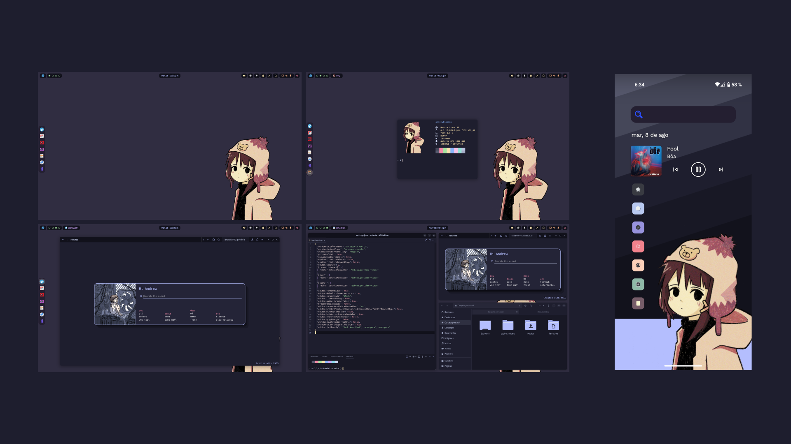
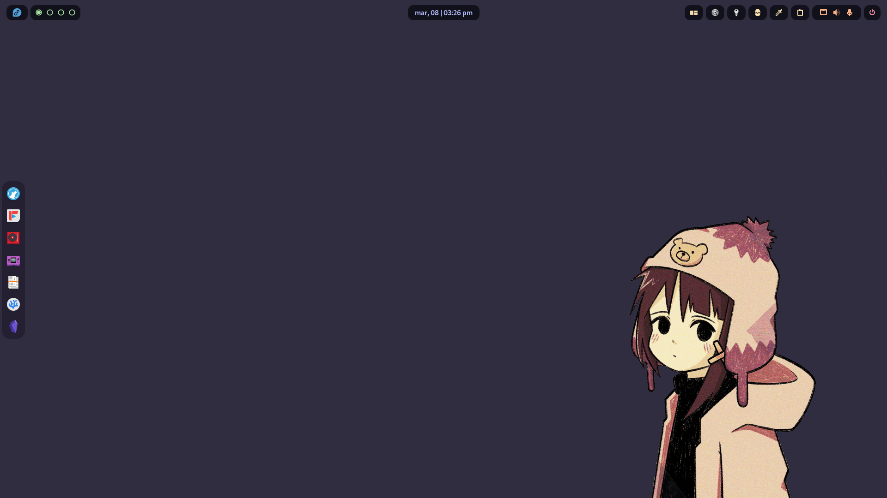
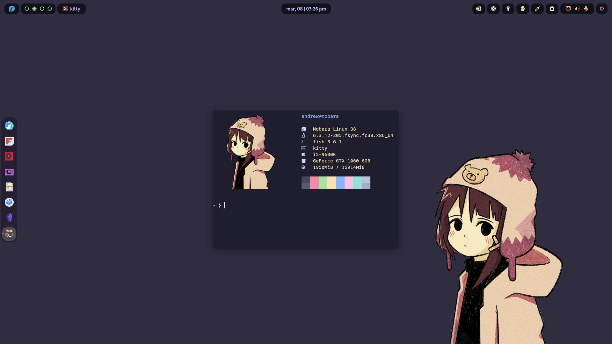
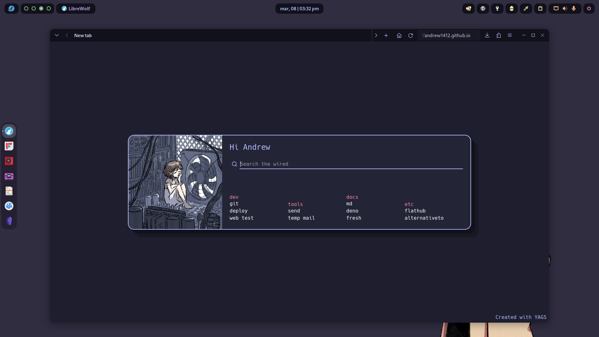
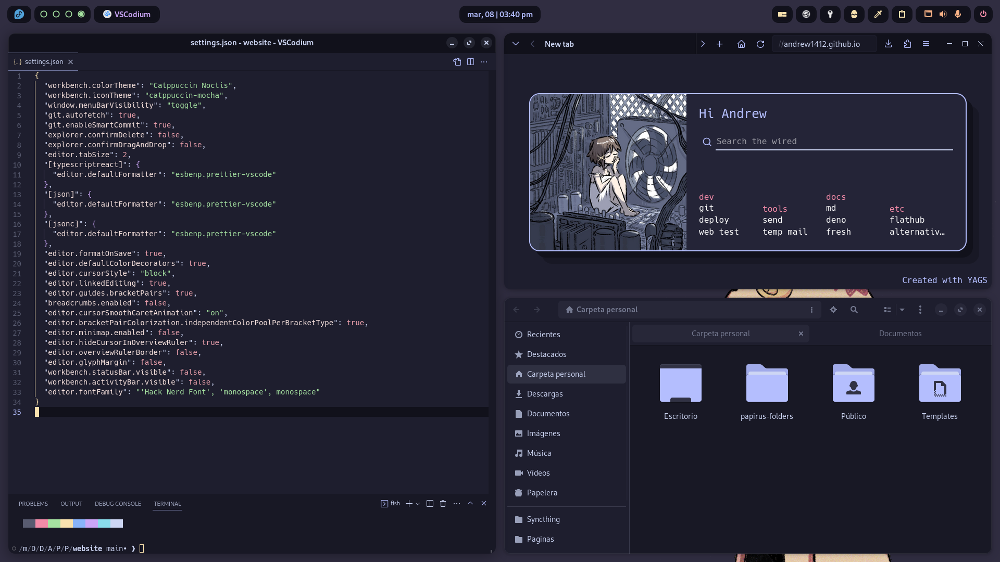
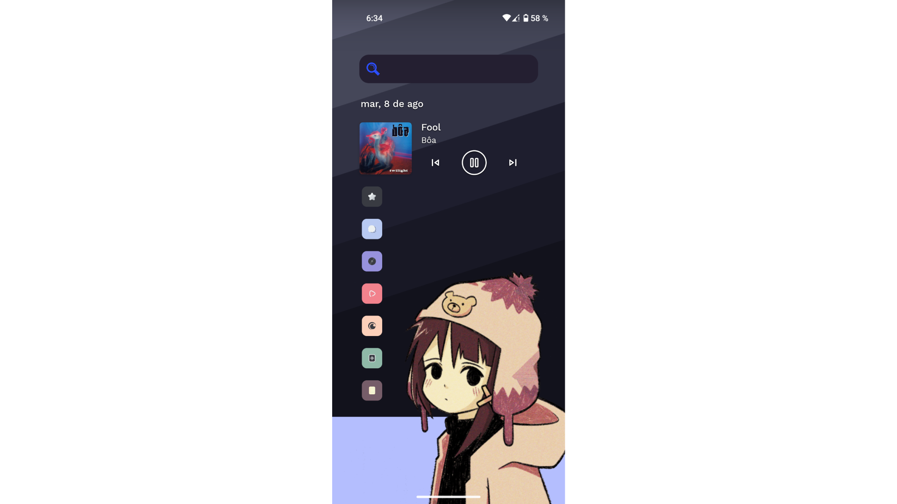

<h1 align="center">
My Catppuccin rice of Serial Experiments Lain
</h1>

>*Read this document in other languages: [English](README.md), [Spanish](docs/README.es.md) (You can contribute to add more)*

<h3><samp>🖼️ Screenshots</samp></h3>

<h3><samp>🖥️ Desktop</samp></h3>

- OS: [Nobara 38 Gnome](https://nobaraproject.org/)
- DE: Gnome  44.2
- Theme: [MochaTheme-4](https://github.com/lime-desu/MochaTheme) + [Gradience](https://github.com/GradienceTeam/Gradience)
- Cursor: [Afterglow Recolored Catppuccin Macchiato V3](https://github.com/TeddyBearKilla/Afterglow-Cursors-Recolored)
- Top Panel: Modified `gnome-shell.css` included in the theme
- Icons: [Papirus Dark](https://github.com/PapirusDevelopmentTeam/papirus-icon-theme) + [Papirus Folders](https://github.com/catppuccin/papirus-folders)
- Fonts: [Hack Nerd](https://github.com/ryanoasis/nerd-fonts/releases/download/v3.0.2/Gohu.zip), [Cantarell](https://cantarell.gnome.org/releases/cantarell-fonts-0.303.tar.xz)
- Wallpeper: [1920x1080](https://raw.githubusercontent.com/andrew1412/lain-catppuccin-dotfiles/main/wallpapers/desktop.png)

<h3><samp>🧩 Extensions</samp></h3>

System
- [AppIndicator and KStatusNotifierItem Support](https://extensions.gnome.org/extension/615/appindicator-support/)
- [Dash to Dock](https://extensions.gnome.org/extension/307/dash-to-dock/)
- [GSConnect](https://extensions.gnome.org/extension/1319/gsconnect/)
- [Just Perfection](https://extensions.gnome.org/extension/3843/just-perfection/)
- [User Themes](https://extensions.gnome.org/extension/19/user-themes/)

User
- [Auto Activities](https://extensions.gnome.org/extension/5500/auto-activities/)
- [Aylur's Widgets](https://extensions.gnome.org/extension/5338/aylurs-widgets/)
- [Clipboard Indicator](https://extensions.gnome.org/extension/779/clipboard-indicator/)
- [Color Picker](https://extensions.gnome.org/extension/3396/color-picker/)
- [Colored Application Menu Icon](https://extensions.gnome.org/extension/4408/app-menu-icon-remove-symbolic/)
- [Cronomix](https://extensions.gnome.org/extension/6003/cronomix/)
- [Gnome 4x UI Improvements](https://extensions.gnome.org/extension/4158/gnome-40-ui-improvements/)
- [Lineup](https://extensions.gnome.org/extension/5955/lineup/)
- [Logo Menu](https://extensions.gnome.org/extension/4451/logo-menu/)
- [Pop Shell](https://support.system76.com/articles/pop-shell/)
- [Quick Setting Tweaker](https://extensions.gnome.org/extension/5446/quick-settings-tweaker/)
- [Rounded Window Corners](https://extensions.gnome.org/extension/5237/rounded-window-corners/)
- [User Avatar In Quick Settings](https://extensions.gnome.org/extension/5506/user-avatar-in-quick-settings/)

<h3><samp>🐟 Terminal</samp></h3>

- Emulator: [Kitty](https://github.com/kovidgoyal/kitty)
- Shell: [Fish](https://github.com/fish-shell/fish-shell)
- Framework: [Fisher](https://github.com/jorgebucaran/fisher)
- Prompt: [Hydro](https://github.com/jorgebucaran/hydro)
- Theme: [Kitty](https://github.com/catppuccin/kitty) + [Fish](https://github.com/catppuccin/fish)

<h3><samp>📱 Phone</samp></h3>

- OS: [GrapheneOS](https://grapheneos.org/) Android 13
- Wallpaper: [1080x2340](https://raw.githubusercontent.com/andrew1412/lain-catppuccin-dotfiles/main/wallpapers/phone.png)
> ⚠️ Installed from the [Aurora Store](https://f-droid.org/en/packages/com.aurora.store/) and with Network Disabled ⬇️
- Launcher: [Niagara Launcher](https://play.google.com/store/search?q=niagara+launcher&c=apps&gl=EG)
- Icons: [Taco Taco ](https://play.google.com/store/apps/details?id=com.themesonfire.iconpack.taco_taco.paid&gl=EG)
- Search Bar: [Custom Search Bar Widget](https://play.google.com/store/apps/details?id=com.natewren.csbw&gl=EG)

<h3><samp>💾 Programs</samp></h3>

  
> FOSS = 🟢 | Non FOSS = 🔴

Pc
- 🟢 [AdwSteamGtk](https://flathub.org/apps/io.github.Foldex.AdwSteamGtk) `Steam theme`
- 🟢 [AM2R launcher](https://flathub.org/apps/io.github.am2r_community_developers.AM2RLauncher) 
- 🟢 [Aviator](https://flathub.org/apps/net.natesales.Aviator) `Video encoding GUI`
- 🟢 [Avvie](https://flathub.org/apps/com.github.taiko2k.avvie) `Make profile pictures`
- 🟢 [Bottles](https://flathub.org/apps/com.usebottles.bottles) `Run Windows apps`
- 🟢 [Catppuccinifier](https://github.com/lighttigerXIV/catppuccinifier) `Convert images to the Catppuccin palette`
- 🟢 [Catridges](https://flathub.org/apps/hu.kramo.Cartridges) `Universal game launcher`
- 🟢 [Cave Story NX](https://flathub.org/apps/com.gitlab.coringao.cavestory-nx)
- 🟢 [Celluloid](https://flathub.org/apps/io.github.celluloid_player.Celluloid) `MPV GTK`
- 🟢 [Dialect](https://flathub.org/apps/app.drey.Dialect) `Translate front end`
- 🟢 [Doom Runner](https://flathub.org/apps/io.github.Youda008.DoomRunner) `Doom launcher`
- 🟢 [EmuDeck](https://www.emudeck.com)
- 🟢 [Extension Manager](https://flathub.org/apps/com.mattjakeman.ExtensionManager) 
- 🟢 [Firefox](https://flathub.org/apps/org.mozilla.firefox) 
- 🟢 [Flatseal](https://flathub.org/apps/com.github.tchx84.Flatseal) `Flatpak manager`
- 🟢 [Flatsweep](https://flathub.org/apps/io.github.giantpinkrobots.flatsweep) `Flatpak cleaner`
- 🟢 [FluffyChat](https://flathub.org/apps/im.fluffychat.Fluffychat) `Matrix client`
- 🟢 [Folio](https://flathub.org/apps/com.toolstack.Folio) `Note taking`
- 🟢 [Fragments](https://flathub.org/apps/de.haeckerfelix.Fragments) `Torrent client`
- 🟢 [FreeTube](https://flathub.org/apps/io.freetubeapp.FreeTube) `YouTube front end`
- 🟢 [Frontends Manager](https://flathub.org/apps/io.github.libredirect.frontends-manager)
- 🔴 [GazoTuber](https://risunz.itch.io/gazo-tuber) `PNGtuver`
- 🟢 [GIMP](https://flathub.org/apps/org.gimp.GIMP) 
- 🟢 [Gradience](https://flathub.org/apps/com.github.GradienceTeam.Gradience) 
- 🟢 [GZDoom](https://flathub.org/apps/org.zdoom.GZDoom) 
- 🟢 [Heroic Games Launcher](https://flathub.org/apps/com.heroicgameslauncher.hgl) `Epic Games Launcher client`
- 🟢 [Impression](https://flathub.org/apps/io.gitlab.adhami3310.Impression) `USB ISO flasher`
- 🟢 [Inkscape](https://flathub.org/apps/org.inkscape.Inkscape)
- 🟢 [Jellyfin](https://flathub.org/apps/org.jellyfin.JellyfinServer)
- 🟢 [KeePassXC](https://flathub.org/apps/org.keepassxc.KeePassXC) `Password manager`
- 🟢 [Kitty](https://github.com/kovidgoyal/kitty) 
- 🟢 [Komikku](https://flathub.org/apps/info.febvre.Komikku) `Manga reader`
- 🟢 [LibreWolf](https://flathub.org/apps/io.gitlab.librewolf-community) `Hardened Firefox`
- 🟢 [Login Manager Settings](https://flathub.org/apps/io.github.realmazharhussain.GdmSettings) 
- 🟢 [Lutris](https://flathub.org/apps/net.lutris.Lutris) 
- 🟢 [Miru](https://flathub.org/apps/io.github.thaunknown.miru) `Anime provider`
- 🟢 [Monophony](https://flathub.org/apps/io.gitlab.zehkira.Monophony) `YouTube Music front end`
- 🟢 [Neovim](https://github.com/neovim/neovim) 
- 🟢 [NewsFlash](https://flathub.org/apps/io.gitlab.news_flash.NewsFlash) `RSS reader`
- 🔴 [Obsidian](https://flathub.org/apps/md.obsidian.Obsidian) `Note taking`
- 🟢 [OBS Studio](https://flathub.org/apps/com.obsproject.Studio) 
- 🟢 [OnlyOffice](https://flathub.org/apps/org.onlyoffice.desktopeditors) 
- 🟢 [Parabolic](https://flathub.org/apps/org.nickvision.tubeconverter) `YouTube downloader`
- 🟢 [Pitivi](https://flathub.org/apps/org.pitivi.Pitivi) `Video editor`
- 🟢 [PNGTuber+](https://kaiakairos.itch.io/pngtuber-plus) `PNGtuver`
- 🟢 [Prism Launcher](https://flathub.org/apps/org.prismlauncher.PrismLauncher) `Minecraft launcher`
- 🟢 [Save Desktop](https://flathub.org/apps/io.github.vikdevelop.SaveDesktop) `Save your desktop theme and apps`
- 🔴 [Steam](https://flathub.org/apps/com.valvesoftware.Steam) 
- 🟢 [Syncthing GTK](https://flathub.org/apps/me.kozec.syncthingtk) `Sync files between devices`
- 🟢 [Taisei Project](https://flathub.org/apps/org.taisei_project.Taisei) `FOSS Touhou`
- 🟢 [Video Trimer](https://flathub.org/apps/org.gnome.gitlab.YaLTeR.VideoTrimmer) `Make clips`
- 🟢 [VSCodium](https://flathub.org/apps/com.vscodium.codium) `VSCode without the bad`
- 🟢 [Webapp Manager](https://github.com/linuxmint/webapp-manager) 
- 🟢 [WebCord](https://flathub.org/apps/io.github.spacingbat3.webcord) `Discord client`
- 🟢 [Zelda3](https://flathub.org/apps/io.github.snesrev.Zelda3) `A Link to the Past port`

Phone
- 🟢 [Aegis](https://github.com/beemdevelopment/Aegis) `2FA`
- 🟢 [Aliucord](https://github.com/Aliucord/Aliucord) `Discord client`
- 🟢 [Animiru](https://github.com/Quickdesh/Animiru) `Media provider`
- 🟢 [Aurora Store](https://f-droid.org/en/packages/com.aurora.store/) `Playstore alternative`
- 🟢 [Calculator-Inator](https://github.com/prathameshmm02/Calculator-inator) `Calculator and converter`
- 🟢 [Calendar](https://github.com/FossifyOrg/Calendar) 
- 🟢 [Breezy Weather](https://github.com/breezy-weather/breezy-weather)
- 🟢 [Boorusphere](https://github.com/nullxception/boorusphere) `Booru client for wallpapers`
- 🔴 [Crunchyroll](https://play.google.com/store/apps/details?id=com.crunchyroll.crunchyroid)
- 🟢 [Clipious](https://github.com/lamarios/clipious) `YouTube front end`
- 🔴 [CSBW](https://play.google.com/store/apps/details?id=com.natewren.csbw) `Custom search bar widget`
- 🟢 [Dantotsu](https://github.com/rebelonion/Dantotsu) `AniList client + anime and manga provider`
- 🟢 [Droid-ify](https://github.com/Droid-ify/client) `F-Droid client`
- 🟢 [Dumbphone Assistant](https://f-droid.org/packages/com.github.yeriomin.dumbphoneassistant/) `Save contacts in SIM`
- 🟢 [FluffyChat](https://github.com/krille-chan/fluffychat) `Matrix client`
- 🟢 [Gallery](https://github.com/IacobIonut01/Gallery)
- 🟢 [HeliBoard](https://github.com/Helium314/HeliBoard)
- 🟢 [Image Toolbox](https://github.com/T8RIN/ImageToolbox) `Corp and resize images`
- 🟢 [InnerTune](https://github.com/z-huang/InnerTune) `YouTube Music front end`
- 🟢 [KDE Connect](https://f-droid.org/packages/org.kde.kdeconnect_tp/) `Share files with Pc`
- 🟢 [KeePassDX](https://github.com/Kunzisoft/KeePassDX) `Pasword manager`
- 🟢 [KurobaEx](https://github.com/K1rakishou/Kuroba-Experimental) `Imageboardr client`
- 🟢 [Molly](https://github.com/mollyim/mollyim-android) `Signal client`
- 🟢 [MPV](https://github.com/mpv-android/mpv-android) `Video player`
- 🟢 [Mull](https://f-droid.org/en/packages/us.spotco.fennec_dos/) `Hardened Firefox`
- 🔴 [Netflix](https://play.google.com/store/apps/details?id=com.netflix.mediaclient) 
- 🔴 [Niagara Launcher](https://play.google.com/store/apps/details?id=bitpit.launcher) 
- 🔴 [Obnsidian](https://play.google.com/store/apps/details?id=md.obsidian) `Note taking`
- 🟢 [Obtainium](https://github.com/ImranR98/Obtainium) `FOSS apps downloader`
- 🟢 [Organic Maps](https://github.com/organicmaps/organicmaps) 
- 🟢 [Photon](https://github.com/abhi16180/photon) `Share files between android devices`
- 🟢 [PipePipe](https://github.com/InfinityLoop1308/PipePipe) `YouTube front end`
- 🟢 [Pocket Paint](https://github.com/Catrobat/Paintroid/) 
- 🟢 [Proton Mail](https://github.com/ProtonMail/proton-mail-android)
- 🟢 [Proton VPN](https://github.com/ProtonVPN/android-app)
- 🔴 [RAR](https://play.google.com/store/apps/details?id=com.rarlab.rar) 
- 🟢 [Read You](https://github.com/Ashinch/ReadYou) `RSS reader`
- 🟢 [Record You](https://github.com/you-apps/RecordYou) 
- 🟢 [Seal](https://github.com/JunkFood02/Seal) `YouTube downloader`
- 🟢 [Shattered Pixel Dungeon](https://github.com/00-Evan/shattered-pixel-dungeon) 
- 🟢 [Squawker](https://github.com/j-fbriere/squawker) `Twitter front end`
- 🟢 [Stealth](https://f-droid.org/packages/com.cosmos.unreddit/) `Reddit front end`
- 🔴 [Steam](https://play.google.com/store/apps/details?id=com.valvesoftware.android.steam.community) 
- 🟢 [Syncthing](https://github.com/syncthing/syncthing-android) `Sync files between devices`
- 🔴 [Taco Taco](https://play.google.com/store/apps/details?id=com.themesonfire.iconpack.taco_taco.paid) 
- 🟢 [Thunder](https://github.com/thunder-app/thunder) `Lemmy client`
- 🟢 [Translate You](https://github.com/you-apps/TranslateYou) 
- 🟢 [Waistline](https://github.com/davidhealey/waistline) `Calorie counter and weight tracker`
- 🔴 [WhatsApp](https://play.google.com/store/apps/details?id=com.whatsapp)
- 🟢 [Xtra](https://github.com/crackededed/Xtra) `Twitch client`

<h3><samp>✨ More…</samp></h3>

- [Firefox CSS](https://codeberg.org/Freeplay/Firefox-Onebar)
- [Catppuccin for Firefox](https://github.com/catppuccin/firefox)
- [Starpage](https://github.com/PrettyCoffee/yet-another-generic-startpage)
- [My custom theme for the startpage](https://github.com/andrew1412/lain-catppuccin-dotfiles/blob/main/extras/startpage%20theme/ls-backup.json) `download it as raw and import it`
- [Catppuccin for VSCode](https://github.com/alexdauenhauer/catppuccin-noctis)

<h3><samp>🏅 Credits</samp></h3>

- [Catppuccin](https://github.com/catppuccin/catppuccin)
- [Drawing of Lain in wallpaper](https://www.instagram.com/thecryptidhermit/)
- [Drawing of Lain in startpage](https://www.instagram.com/truffle.duster/)
- [Neofetch](https://github.com/dylanaraps/neofetch)
- [Neofetch Themes](https://github.com/Chick2D/neofetch-themes/tree/main)

