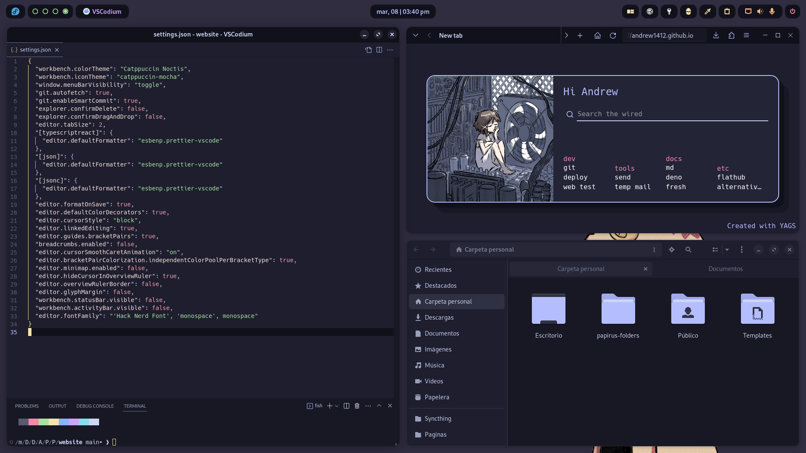

<h1 align="center">
Mi rice Catppuccin de Serial Experiments Lain
</h1>

*Lee este documento en otros idiomas: [Español](docs/README.es.md), [Ingles](../README.md) (Puedes contribuir a añadir mas)*

<h3><samp>🖼️ Screenshots</samp></h3>

<h3><samp>🖥️ Escritorio</samp></h3>

- SO: [Nobara 38 Gnome](https://nobaraproject.org/)
- DE: Gnome  44.2
- Tema: [MochaTheme-4](https://github.com/lime-desu/MochaTheme) + [Gradience](https://github.com/GradienceTeam/Gradience)
- Panel Superior: Modificacion de `gnome-shell.css` incluido en el tema
- Iconos: [Papirus Dark](https://github.com/PapirusDevelopmentTeam/papirus-icon-theme) + [Papirus Folders](https://github.com/catppuccin/papirus-folders)
- Fuentes: [Hack Nerd](https://github.com/ryanoasis/nerd-fonts/releases/download/v3.0.2/Gohu.zip), [Cantarell](https://cantarell.gnome.org/releases/cantarell-fonts-0.303.tar.xz)
- Wallpeper: [1920x1080](https://raw.githubusercontent.com/andrew1412/lain-catppuccin-dotfiles/main/wallpapers/desktop.png)

<h3><samp>🧩 Extensiones</samp></h3>

Sistema
- [AppIndicator and KStatusNotifierItem Support](https://extensions.gnome.org/extension/615/appindicator-support/)
- [Dash to Dock](https://extensions.gnome.org/extension/307/dash-to-dock/)
- [GSConnect](https://extensions.gnome.org/extension/1319/gsconnect/)
- [Just Perfection](https://extensions.gnome.org/extension/3843/just-perfection/)
- [User Themes](https://extensions.gnome.org/extension/19/user-themes/)

Usuario
- [Auto Activities](https://extensions.gnome.org/extension/5500/auto-activities/)
- [Aylur's Widgets](https://extensions.gnome.org/extension/5338/aylurs-widgets/)
- [Clipboard Indicator](https://extensions.gnome.org/extension/779/clipboard-indicator/)
- [Color Picker](https://extensions.gnome.org/extension/3396/color-picker/)
- [Colored Application Menu Icon](https://extensions.gnome.org/extension/4408/app-menu-icon-remove-symbolic/)
- [Cronomix](https://extensions.gnome.org/extension/6003/cronomix/)
- [Gnome 4x UI Improvements](https://extensions.gnome.org/extension/4158/gnome-40-ui-improvements/)
- [Lineup](https://extensions.gnome.org/extension/5955/lineup/)
- [Logo Menu](https://extensions.gnome.org/extension/4451/logo-menu/)
- [Pop Shell](https://support.system76.com/articles/pop-shell/)
- [Quick Setting Tweaker](https://extensions.gnome.org/extension/5446/quick-settings-tweaker/)
- [Rounded Window Corners](https://extensions.gnome.org/extension/5237/rounded-window-corners/)
- [User Avatar In Quick Settings](https://extensions.gnome.org/extension/5506/user-avatar-in-quick-settings/)

<h3><samp>🟠Terminal</samp></h3>

- Emulador: [Kitty](https://github.com/kovidgoyal/kitty)
- Shell: [Fish](https://github.com/fish-shell/fish-shell)
- Framework: [Fisher](https://github.com/jorgebucaran/fisher)
- Prompt: [Hydro](https://github.com/jorgebucaran/hydro)
- Tema: [Kitty](https://github.com/catppuccin/kitty) + [Fish](https://github.com/catppuccin/fish)

<h3><samp>📱 Celular</samp></h3>

- SO: [GrapheneOS](https://grapheneos.org/) Android 13
- Wallpaper: [1080x2340](https://raw.githubusercontent.com/andrew1412/lain-catppuccin-dotfiles/main/wallpapers/phone.png)
> ⚠️ Instalado de [Aurora Store](https://f-droid.org/en/packages/com.aurora.store/) y con Internet Deshabilitado ⬇️
- Launcher: [Niagara Launcher](https://play.google.com/store/search?q=niagara+launcher&c=apps&gl=EG)
- Iconos: [Taco Taco ](https://play.google.com/store/apps/details?id=com.themesonfire.iconpack.taco_taco.paid&gl=EG)
- Barra de busqueda: [Custom Search Bar Widget](https://play.google.com/store/apps/details?id=com.natewren.csbw&gl=EG)

<h3><samp>💾 Programas</samp></h3>

  
> FOSS = 🟢 | Non FOSS = 🔴

Pc
- 

Celular
- 🟢 [Aegis](https://github.com/beemdevelopment/Aegis) `2FA`
- 🟢 [Aliucord](https://github.com/Aliucord/Aliucord) `Cleinte de discord`
- 🟢 [Animiru](https://github.com/Quickdesh/Animiru) `Provedor de anime`
- 🟢 [Aurora Store](https://f-droid.org/en/packages/com.aurora.store/) `Alternative a la playstore`
- 🟢 [Calculator-Inator](https://github.com/prathameshmm02/Calculator-inator) `Calculadora y conversor`
- 🟢 [Simple Calendar](https://github.com/SimpleMobileTools/Simple-Calendar) 
- 🟢 [Breezy Weather](https://github.com/breezy-weather/breezy-weather) 
- 🔴 [Crunchyroll](https://play.google.com/store/apps/details?id=com.crunchyroll.crunchyroid) 
- 🔴 [CSBW](https://play.google.com/store/apps/details?id=com.natewren.csbw) `Widget de barra de busqueda`
- 🟢 [Dumbphone Assistant](https://f-droid.org/packages/com.github.yeriomin.dumbphoneassistant/) `Guarda contactos en la SIM`
- 🟢 [Gallery](https://github.com/IacobIonut01/Gallery) 
- 🟢 [Image Toolbox](https://github.com/T8RIN/ImageToolbox) `Recorta y ajusta imagenes`
- 🟢 [InnerTune](https://github.com/z-huang/InnerTune) `Front end de YouTube Music`
- 🟢 [KDE Connect](https://f-droid.org/packages/org.kde.kdeconnect_tp/) `Envia archivos al Pc`
- 🟢 [KeePassDX](https://github.com/Kunzisoft/KeePassDX) `Gestor de contraseñas`
- 🟢 [LibreTube](https://github.com/libre-tube/LibreTube) `Front end de YouTube`
- 🟢 [Molly](https://github.com/mollyim/mollyim-android) `Cliente de signal`
- 🟢 [MPV](https://github.com/mpv-android/mpv-android) `Reproductor de video`
- 🟢 [Mull](https://f-droid.org/en/packages/us.spotco.fennec_dos/) `Firefox Mejorado`
- 🔴 [Netflix](https://play.google.com/store/apps/details?id=com.netflix.mediaclient) 
- 🟢 [NewPipe](https://github.com/TeamNewPipe/NewPipe) `Front end de YouTube`
- 🔴 [Niagara Launcher](https://play.google.com/store/apps/details?id=bitpit.launcher) 
- 🔴 [Obnsidian](https://play.google.com/store/apps/details?id=md.obsidian) `Notas`
- 🟢 [Obtainium](https://github.com/ImranR98/Obtainium) `Descarga aplicaciones FOSS`
- 🟢 [Open Board](https://github.com/openboard-team/openboard) 
- 🟢 [Organic Maps](https://github.com/organicmaps/organicmaps) 
- 🟢 [Photon](https://github.com/abhi16180/photon) `Comparte archivos entre celulares`
- 🟢 [Pocket Paint](https://github.com/Catrobat/Paintroid/) 
- 🟢 [Proton Mail](https://github.com/ProtonMail/proton-mail-android) 
- 🔴 [RAR](https://play.google.com/store/apps/details?id=com.rarlab.rar) 
- 🟢 [Read You](https://github.com/Ashinch/ReadYou) `Lector de RSS`
- 🟢 [Record You](https://github.com/you-apps/RecordYou) 
- 🟢 [Seal](https://github.com/JunkFood02/Seal) `Descarga videos de YouTube`
- 🟢 [Shattered Pixel Dungeon](https://github.com/00-Evan/shattered-pixel-dungeon) 
- 🟢 [Squawker](https://github.com/j-fbriere/squawker) `Front end de Twitter`
- 🟢 [Stealth](https://f-droid.org/packages/com.cosmos.unreddit/) `Front end de Reddit`
- 🔴 [Steam](https://play.google.com/store/apps/details?id=com.valvesoftware.android.steam.community) 
- 🟢 [Syncthing](https://github.com/syncthing/syncthing-android) `Sincroniza archivos entre dispositivos`
- 🟢 [TachiJ2K](https://github.com/Jays2Kings/tachiyomiJ2K) `Lector de Manga`
- 🔴 [Taco Taco](https://play.google.com/store/apps/details?id=com.themesonfire.iconpack.taco_taco.paid) 
- 🟢 [Thunder](https://github.com/thunder-app/thunder) `Cliente de Lemmy`
- 🟢 [Translate You](https://github.com/you-apps/TranslateYou) 
- 🟢 [Waistline](https://github.com/davidhealey/waistline) `Contador de calorias`
- 🔴 [WhatsApp](https://play.google.com/store/apps/details?id=com.whatsapp) 

<h3><samp>✨ Mas…</samp></h3>

- [Firefox CSS](https://codeberg.org/Freeplay/Firefox-Onebar)
- [Catppuccin para Firefox](https://github.com/catppuccin/firefox)
- [Starpage](https://github.com/PrettyCoffee/yet-another-generic-startpage)
- [Mi tema personalizado para la starpage](https://github.com/andrew1412/lain-catppuccin-dotfiles/blob/main/extras/startpage%20theme/ls-backup.json) `descargalo como raw e importalo`
- [Catppuccin para VSCode](https://github.com/alexdauenhauer/catppuccin-noctis)

<h3><samp>🅠Creditos</samp></h3>

- [Catppuccin](https://github.com/catppuccin/catppuccin)
- [Dibujo de Lain en el wallpaper](https://www.instagram.com/thecryptidhermit/)
- [Dibujo de Lain en la startpage](https://www.instagram.com/truffle.duster/)
- [Neofetch](https://github.com/dylanaraps/neofetch)
- [Temas de Neofetch](https://github.com/Chick2D/neofetch-themes/tree/main)

